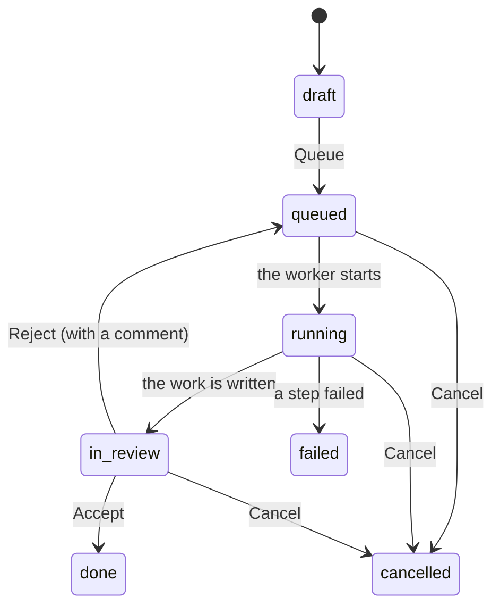

# AutoLab user guide

How to use the AutoLab web app. For running it yourself see
`DEVELOPMENT.md` (your computer) or `DEPLOY.md` (the test server). For a
short guided tour see `docs/TRY_IT.md`.

## What AutoLab does

You give AutoLab a task, for example "Why is the sky blue?". A small local
language model works on it in many small steps: it plans web searches,
reads the pages, takes short facts **with exact quotes**, checks them, and
writes a text. Every sentence of the text points to a fact, and every fact
has a source and a quote, so you can check it.

A person then **reviews** the result: accept it, or reject it with a
comment, and the model tries again. An accepted result can be
**published** to a public feed.

## Words

| Word | Meaning |
|---|---|
| Workspace | A project folder for people, tasks and files. Private or public. |
| Task | One request to the model, for example a research question. |
| Pipeline | The recipe a task follows (today: `research`). A list of steps. |
| Step | One part of the pipeline: plan, search, fetch, summarize, verify, synthesize, write. |
| Model call | One question to the model inside a step. You can read its full prompt and answer. |
| Work | The result of a task: a text, its sources and quotes. |
| Source / quote | A web page, and the exact sentence taken from it as evidence. |
| Review | A person's decision about a work: accepted, or rejected with a comment. |
| Publisher | A public name (yours, or a project's) that publishes works. |
| Publication | A published work in the public feed. |

## Account

- **Sign up** with email, username (3–32 letters, digits or `_`), name and
  a password of at least 8 characters.
- You stay logged in on this browser for 30 days after your last visit.
  **Log out** is at the top right.
- The header shows **Workspaces**, **Feed**, and **Admin** (admins only).

## Workspaces

The start page lists workspaces in three tabs:

- **Mine**: where you are the owner or a member.
- **Public**: public workspaces of other people.
- **Free to take**: public workspaces that were archived and have no owner.

**New workspace** creates a private workspace; you are its owner.

On a workspace page the owner sees these buttons (each one asks first):

| Button | What happens |
|---|---|
| Edit | Change name and description. |
| Make public | Everyone can see the name, the description and accepted works. **Cannot be undone.** |
| Archive | Read-only. All members are removed. A *public* workspace also loses its owner and becomes free to take. |
| Unarchive | A private archived workspace becomes active again (members do not come back). |
| Delete | Only a workspace without tasks. Its files are deleted too. |

Others may see **Take** (a free workspace: you become the owner) or
**Leave** (you are a member and want to go).

### Tabs on a workspace page

People inside the workspace see tabs: **Tasks**, **Works**, **Files**,
**Members**, and **Activity** (owner and editors). Visitors of a public
workspace see only its accepted works.

## Members and roles

Every person in a workspace has the base role **member**. Two roles can
be added on top. The owner is not a role; there is one owner.

| What | Owner | Editor | Reviewer | Member |
|---|:-:|:-:|:-:|:-:|
| See tasks, steps, model calls, works, files, members | ✓ | ✓ | ✓ | ✓ |
| Download files | ✓ | ✓ | ✓ | ✓ |
| Create, queue, edit, cancel, delete tasks | ✓ | ✓ | | |
| Upload and remove files | ✓ | ✓ | | |
| Review any task | ✓ | ✓ | ✓ | only if assigned |
| Read the activity log | ✓ | ✓ | | |
| Give / take the reviewer role | ✓ | ✓ | | |
| Give / take the editor role | ✓ | | | |
| Add and remove people | ✓ | | | |
| Edit, archive, make public, delete the workspace | ✓ | | | |
| Publish a work | ✓ | | | |

On the **Members** tab the owner adds people by **username or email**.
Roles are checkboxes next to each person. The first row is the owner.

## Files

On the **Files** tab the owner and editors can **upload** files (several
at once, up to 50 MB each) and **remove** them. Everyone inside can
download them. (The research pipeline does not read files yet; they are
for the people of the workspace.)

## Tasks

**Tasks → New task** asks for:

- **Title** and **Task**: what to research, in plain words.
- **Pipeline**: what kind of task it is (see *Pipelines* below).
- **Model**: only models an admin made available.
- **Reviewer**: who must review the result (default: you).

### Pipelines

| Pipeline | For | Time (3B model) | Result |
|---|---|---|---|
| `research` | a question that needs a few web sources | 3-4 min | text with sources and quotes (8 readable pages) |
| `deep_research` | a big topic | 25-40 min | sub-questions, 3 search rounds that fill the gaps, up to ~65 pages, one section per sub-question |
| `code` | a small program (1-2 files) | 1-2 min | the files, static check results, usage notes |
| `python_cli` | a Python command-line tool | 3-6 min | requirements, 2-4 files with tests, two check-and-fix rounds, review notes, usage |

Code is **checked statically only** (syntax and `ruff`): it is never run.
Read it and its review notes before you accept it. Code works have no
sources, so they show no "Sources and quotes" card.

**Language.** Write the task in the language you want the result in.
AutoLab finds it by the alphabet (Cyrillic → Russian, …) and tells the
model to write in it. Quotes stay in the language of their source (they
must be exact), so a Russian report can quote English pages. If a
section still comes back in another language, its step summary says so.

A new task is a **draft**: nothing runs yet. Check it, **Edit** it if
needed, then press **Queue**.

| Status | Meaning |
|---|---|
| Draft | Created, not started. Can be edited. |
| Queued | Waiting for the worker (one task at a time on a small GPU). |
| Running | The worker is doing the steps. The page updates every 3 seconds. |
| In review | The work is ready; the reviewer decides. |
| Done | Accepted. Can be published. |
| Failed | A step could not finish. The steps show where it stopped. |
| Cancelled | Stopped by a person. Cannot be started again. |

A running task cannot be deleted: cancel it first.

### Watching a task

The task page shows every step with an icon (waiting, running, done), a
short summary (for example "3 search queries") and how long it took.
Under each step are its **model calls**: status, tokens, time, and marks
like *cut off* or *not valid JSON*. **Click a call** to read the full
system prompt, prompt, the expected JSON shape and the model's answer.
This is the best way to understand why a result is good or bad.

## Reading a result

When the work is written, the task page shows **Result**:

- The text, with section headings. Numbers like `[1]` point to facts.
- Sentences marked **(⚠ no source)**: the model wrote them without a
  fact. Small models do this often. A warning above the text counts them.
  Check them before you accept.
- **Sources and quotes**: every web page used, and the exact sentences
  taken from it, with the claim each one supports.

Text from the model and from web pages is shown as plain text only: no
scripts, no images from other sites.

## Reviewing

The **Review** card appears when a task is *in review*, for the assigned
reviewer, the owner, editors and reviewers.

- **Accept**: the task is done.
- **Reject and run again**: write a comment first (the button stays off
  without one). Say what to fix, for example "Sentence 2 needs a source".
  The last steps run again with your comment; the new steps appear under
  *Revision after a rejected review*.

All reviews stay listed with name, date and comment. The owner and
editors can change the reviewer in the task header until the task is done.

## Publishing and the feed

On a **done** task the workspace owner sees **Publish**:

1. Choose one of your **publishers**, or *New publisher…* and type a name
   (unique, shown in the feed).
2. Title (default: the task title) and an optional description.
3. **Publish**. A work is published only once.

The **Feed** (header) lists all publications, newest first, also for
people without an account. A publication page shows the text with its
sources and quotes. A publisher page shows everything it published.

## For admins

**Admin** in the header (only admins see it):

- **Models**: add a model (provider, name exactly as the provider calls
  it, for example `qwen2.5:3b`, context length) and tick **Available**.
  Only available models appear in *New task*. For Ollama the model must
  also be pulled on the server: `ollama pull qwen2.5:3b`.
- **Providers**: where models run. Only `ollama` works today.
- **Activity**: the global log (admin rights, publishers, …).
- **Admins**: give or take admin rights by **user id**. You find the id
  on the Members tab (`@bob · id 2`). You cannot remove your own rights.
- On any publication: **Remove from the feed** (the work stays in its
  workspace).

The first admin is made on the server: `autolab create-admin <user_id>`.

## Known limits (now)

- One small local model: a research task takes 3-4 minutes, a deep research up to 40.
- `opinion_survey`, `study_notes` and `creative_writing` have no file
  yet (planned).
- Generated code is never run (a sandbox is planned).
- English only (all texts are ready for translation).
- No user search, no list of admins, no edit dialog for models (only
  add and *available*).
- Progress is polled every 3 seconds (no live push yet).
- No password reset or email confirmation.
- The test server has no HTTPS and is reachable only on the home network.

Ideas for later: `BACKLOG.md`.
