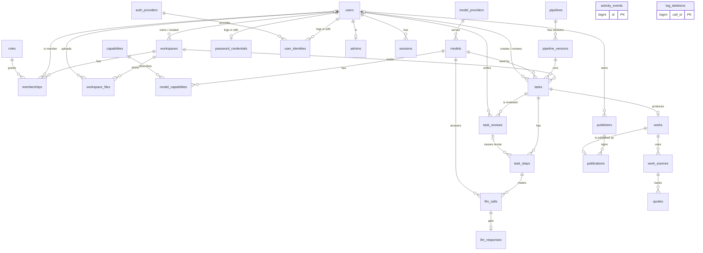

# AutoLab ER diagram

Crow's foot notation (Mermaid `erDiagram`). It renders in GitHub, Obsidian
and PyCharm (Markdown preview). Generated from `workbench_schema.sql`.
Keep it in sync with the SQL and `workbench_schema.dbml`.

How to read the lines:

| Symbol | Meaning |
|---|---|
| `\|\|` | exactly one |
| `\|o` | zero or one (the FK can be NULL) |
| `o{` | zero or many |
| `o\|` | zero or one (1 : 0..1 tables like `works`, `llm_responses`) |

Not shown as lines: `activity_events` and `log_deletions` have no FKs
on purpose (their rows must survive deletes). The view
`llm_step_budgets` (a report over `llm_calls` and `llm_responses`) is not
an entity, so it is not drawn. `llm_calls.task_id` is
covered by the line to `task_steps` (composite FK `(task_id, step_index)`).

## 1. Overview (entities and relationships)

## 2. Full diagram (with attributes)

`PK` = primary key, `FK` = foreign key, `UK` = unique. Types like
`task_status` are PostgreSQL ENUM types (fixed lists).

```mermaid
erDiagram
    users {
        bigint id PK
        text email UK "unique on lower(email)"
        text username UK
        text display_name
        boolean email_verified
        timestamptz created_at
    }
    workspaces {
        bigint id PK
        text name
        text description
        bigint created_by FK "SET NULL"
        bigint owner_id FK "SET NULL; NULL = free"
        workspace_visibility visibility "private | public"
        timestamptz archived_at "NULL = active"
        timestamptz created_at
    }
    roles {
        smallint id PK
        text name UK
        text description
    }
    memberships {
        bigint workspace_id PK, FK
        bigint user_id PK, FK
        smallint role_id PK, FK
    }
    workspace_files {
        bigint id PK
        bigint workspace_id FK "CASCADE"
        text original_name
        text original_path "for people only"
        text file_name "UK with workspace_id"
        bigint size_bytes
        text sha256
        text content_type
        bigint uploaded_by FK "SET NULL"
        timestamptz created_at
    }
    model_providers {
        smallint id PK
        text name UK
        text adapter "ollama | openai_compatible | anthropic"
        text base_url
        text secret_id
    }
    models {
        bigint id PK
        smallint provider_id FK
        text name "UK with provider_id"
        text base_url
        integer context_length
        integer vram_mb
        integer ram_mb
        numeric cost_per_1m_input
        numeric cost_per_1m_output
        text description
        boolean available
        timestamptz created_at
        model_size_class size_class
        integer reasoning_tokens
        integer max_output_tokens
    }
    capabilities {
        smallint id PK
        text name UK
        text description
    }
    model_capabilities {
        bigint model_id PK, FK
        smallint capability_id PK, FK
        capability_kind kind "strength | weakness"
        text note
    }
    pipelines {
        smallint id PK
        text name UK
        text description
    }
    pipeline_versions {
        bigint id PK
        smallint pipeline_id FK
        text version_name
        integer version_code
        text file_path
        text file_hash
        timestamptz created_at
    }
    tasks {
        bigint id PK
        bigint workspace_id FK "RESTRICT"
        bigint pipeline_version_id FK
        bigint model_id FK
        text title
        text input
        task_status status "draft | queued | running | in_review | done | cancelled | failed"
        bigint created_by FK "SET NULL"
        bigint reviewer_id FK "SET NULL"
        timestamptz created_at
        timestamptz started_at
        timestamptz finished_at
    }
    task_steps {
        bigint task_id PK, FK
        smallint step_index PK
        task_step_status status "pending | running | done"
        text summary
        bigint review_id FK "NULL = normal step"
        timestamptz started_at
        timestamptz finished_at
    }
    llm_calls {
        bigint id PK
        bigint task_id FK
        smallint step_index FK
        bigint model_id FK
        smallint attempt
        llm_call_status status "queued | running | done | failed | cancelled"
        jsonb response_schema
        jsonb params
        text error
        timestamptz created_at
        timestamptz started_at
        timestamptz finished_at
    }
    llm_responses {
        bigint call_id PK, FK
        integer input_tokens
        integer output_tokens
        finish_reason finish_reason "stop | length | other"
        boolean valid_json
        timestamptz created_at
    }
    log_deletions {
        bigint call_id PK "no FK"
        timestamptz created_at
    }
    works {
        bigint task_id PK, FK
        text summary
        text file_path
        timestamptz created_at
        timestamptz updated_at
    }
    work_sources {
        bigint id PK
        bigint work_id FK
        text title
        source_kind kind "web | file"
        text location "UK with work_id"
        timestamptz accessed_at
    }
    quotes {
        bigint id PK
        bigint work_source_id FK
        text claim
        text quote
        text placement
        timestamptz created_at
    }
    task_reviews {
        bigint id PK
        bigint task_id FK
        bigint reviewer_id FK "SET NULL"
        review_result result "accepted | rejected"
        text comment "required when rejected"
        timestamptz created_at
    }
    publishers {
        bigint id PK
        text name UK
        text description
        bigint owner_id FK "SET NULL"
        timestamptz created_at
    }
    publications {
        bigint id PK
        bigint work_id FK, UK "RESTRICT"
        bigint publisher_id FK
        text title
        text description
        timestamptz published_at
    }
    activity_events {
        bigint id PK
        timestamptz occurred_at
        bigint actor_id "no FK"
        text actor_name
        bigint workspace_id "no FK; NULL = global"
        text action
        text target_type
        bigint target_id
        text target_label
        jsonb details
    }
    password_credentials {
        bigint user_id PK, FK
        text password_hash
        timestamptz updated_at
    }
    auth_providers {
        smallint id PK
        text name UK
        boolean enabled
    }
    user_identities {
        bigint id PK
        bigint user_id FK
        smallint provider_id FK
        text provider_user_id "UK with provider_id"
        timestamptz created_at
    }
    admins {
        bigint user_id PK, FK
        timestamptz granted_at
        text granted_by
    }
    sessions {
        bigint id PK
        bigint user_id FK
        text refresh_token_hash UK
        timestamptz created_at
        timestamptz expires_at
        timestamptz last_used_at
        timestamptz revoked_at
        text previous_token_hash
        timestamptz rotated_at
    }

    users |o--o{ workspaces : "owns / created"
    workspaces ||--o{ memberships : "has"
    users ||--o{ memberships : "is member"
    roles ||--o{ memberships : "grants"
    workspaces ||--o{ workspace_files : "stores"
    users |o--o{ workspace_files : "uploads"
    model_providers ||--o{ models : "serves"
    models ||--o{ model_capabilities : "has"
    capabilities ||--o{ model_capabilities : "describes"
    pipelines ||--o{ pipeline_versions : "has versions"
    workspaces ||--o{ tasks : "holds"
    pipeline_versions ||--o{ tasks : "runs"
    models ||--o{ tasks : "used by"
    users |o--o{ tasks : "creates / reviews"
    tasks ||--o{ task_steps : "has"
    task_reviews |o--o{ task_steps : "causes revise"
    task_steps ||--o{ llm_calls : "makes"
    models ||--o{ llm_calls : "answers"
    llm_calls ||--o| llm_responses : "gets"
    tasks ||--o| works : "produces"
    works ||--o{ work_sources : "uses"
    work_sources ||--o{ quotes : "backs"
    tasks ||--o{ task_reviews : "is reviewed"
    users |o--o{ task_reviews : "writes"
    users |o--o{ publishers : "owns"
    publishers ||--o{ publications : "signs"
    works ||--o| publications : "is published as"
    users ||--o| password_credentials : "logs in with"
    users ||--o{ user_identities : "logs in with"
    auth_providers ||--o{ user_identities : "provides"
    users ||--o| admins : "is"
    users ||--o{ sessions : "has"
```

## Export to an image

- dbdiagram.io: import `workbench_schema.dbml`, then export as PNG or PDF.
  This gives a table-style diagram with all columns.
- Mermaid: open the diagrams above in https://mermaid.live and export
  as SVG or PNG.
